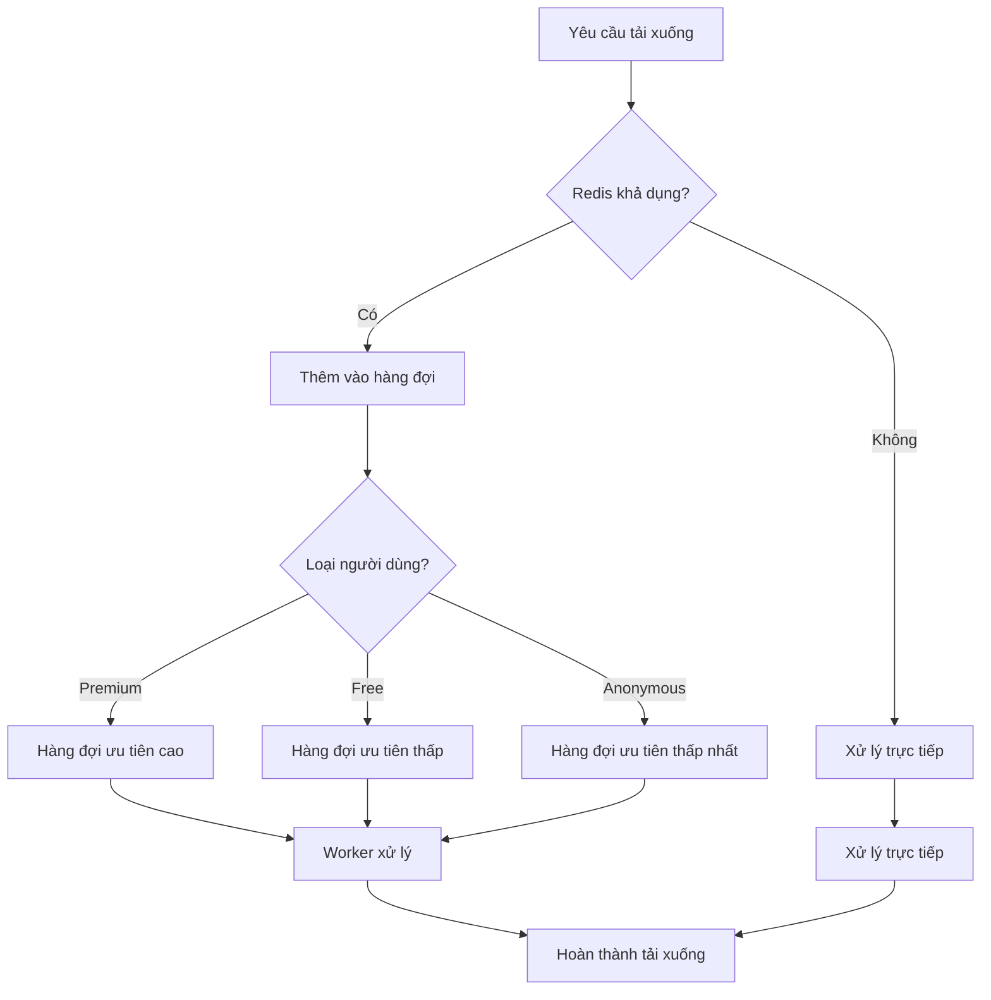
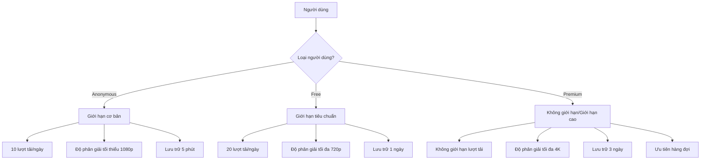
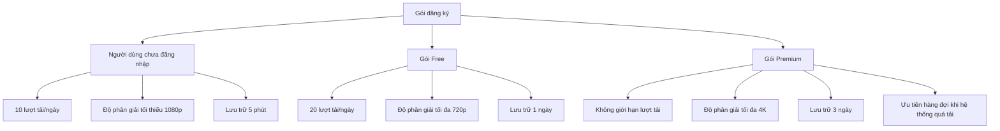
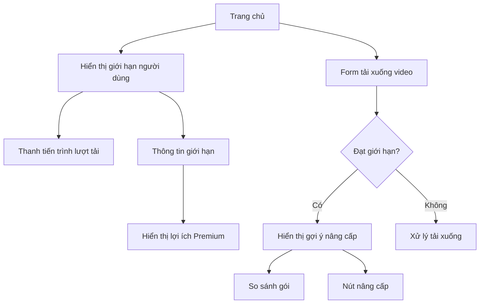

# Kế hoạch cải thiện hệ thống Video Downloader SaaS

## 1. Cải thiện xử lý khi nhiều người tải xuống

### Phân tích hiện trạng
- Hệ thống hiện tại sử dụng Bull và Redis để quản lý hàng đợi tải xuống
- Nếu Redis không khả dụng, hệ thống sẽ xử lý trực tiếp các yêu cầu tải xuống
- Chưa có cơ chế ưu tiên cho người dùng premium khi lưu lượng truy cập cao

### Giải pháp đề xuất

#### 1.1. Cải thiện hệ thống hàng đợi


#### 1.2. Triển khai cơ chế ưu tiên
- Tạo nhiều hàng đợi với mức ưu tiên khác nhau dựa trên loại người dùng
- Người dùng premium sẽ được xử lý trước khi lưu lượng truy cập cao
- Giới hạn số lượng tải xuống đồng thời cho mỗi loại người dùng
- Tăng mức ưu tiên cho người dùng Premium khi hệ thống quá tải

##### Chi tiết triển khai cơ chế ưu tiên
1. **Tạo các hàng đợi riêng biệt**:
   - `premium-queue`: Ưu tiên cao nhất, dành cho người dùng Premium
   - `free-queue`: Ưu tiên trung bình, dành cho người dùng Free
   - `anonymous-queue`: Ưu tiên thấp nhất, dành cho người dùng chưa đăng nhập

2. **Cấu hình Bull để xử lý theo thứ tự ưu tiên**:
   ```javascript
   // Cấu hình các hàng đợi với mức ưu tiên khác nhau
   const premiumQueue = new Queue('premium-queue', redisUrl, {
     priority: 1 // Ưu tiên cao nhất
   });
   
   const freeQueue = new Queue('free-queue', redisUrl, {
     priority: 2 // Ưu tiên trung bình
   });
   
   const anonymousQueue = new Queue('anonymous-queue', redisUrl, {
     priority: 3 // Ưu tiên thấp nhất
   });
   ```

3. **Cơ chế phân phối tài nguyên khi hệ thống quá tải**:
   - Khi hệ thống đạt ngưỡng tải cao (ví dụ: CPU > 80%, RAM > 80%):
     - Tăng số lượng worker xử lý hàng đợi premium
     - Giảm số lượng worker xử lý hàng đợi free và anonymous
     - Tạm dừng xử lý hàng đợi anonymous nếu cần thiết

4. **Giám sát và điều chỉnh động**:
   - Theo dõi hiệu suất hệ thống theo thời gian thực
   - Tự động điều chỉnh số lượng worker cho mỗi hàng đợi dựa trên tải hệ thống
   - Gửi thông báo cho người dùng về thời gian chờ ước tính

#### 1.3. Cải thiện hiệu suất xử lý
- Tối ưu hóa quá trình tải xuống bằng cách sử dụng streaming trực tiếp
- Triển khai cơ chế cache cho thông tin video để giảm tải cho máy chủ
- Thêm cơ chế theo dõi và báo cáo hiệu suất hệ thống

## 2. Cấu hình phân quyền và giới hạn

### Phân tích hiện trạng
- Hệ thống hiện tại có 3 loại người dùng: anonymous, free, premium
- Mỗi loại người dùng có các giới hạn khác nhau về số lượt tải, độ phân giải, thời gian lưu trữ
- Admin có thể cấu hình các giới hạn này trong file settings.json

### Giải pháp đề xuất

#### 2.1. Cải thiện cơ chế phân quyền


#### 2.2. Tạo giao diện quản lý giới hạn cho admin
- Thêm trang quản lý cấu hình trong giao diện admin
- Admin có thể chỉnh sửa các giới hạn cho từng loại người dùng
- Các thay đổi sẽ được áp dụng ngay lập tức mà không cần khởi động lại máy chủ

#### 2.3. Cải thiện cơ chế kiểm tra giới hạn
- Triển khai middleware kiểm tra giới hạn cho mỗi yêu cầu tải xuống
- Thêm cơ chế theo dõi và báo cáo việc sử dụng giới hạn cho người dùng
- Thêm thông báo khi người dùng sắp đạt giới hạn

## 3. Thiết lập các gói đăng ký

### Phân tích hiện trạng
- Hệ thống hiện tại có 2 gói đăng ký: free và premium
- Gói premium có giá settings.premiumPrice/tháng
- Người dùng có thể nâng cấp lên premium thông qua Stripe

### Giải pháp đề xuất

#### 3.1. Cấu trúc gói đăng ký mới


#### 3.2. Cải thiện giao diện đăng ký
- Thiết kế lại trang đăng ký để hiển thị rõ ràng các gói và lợi ích
- Thêm trang so sánh các gói đăng ký
- Thêm cơ chế khuyến mãi và mã giảm giá

#### 3.3. Cải thiện giao diện người dùng để hiển thị giới hạn và gợi ý nâng cấp

##### 3.3.1. Hiển thị giới hạn người dùng
- Thêm thanh tiến trình hiển thị số lượt tải xuống đã sử dụng/còn lại trong ngày
- Hiển thị thông tin về giới hạn độ phân giải và thời gian lưu trữ
- Thông báo khi người dùng sắp đạt giới hạn (ví dụ: còn 2 lượt tải)

##### 3.3.2. Gợi ý nâng cấp Premium
- Thêm banner gợi ý nâng cấp khi người dùng đạt 80% giới hạn lượt tải
- Hiển thị so sánh trực quan giữa gói hiện tại và gói Premium
- Nhấn mạnh các lợi ích cụ thể của gói Premium:
  * Không giới hạn lượt tải xuống
  * Độ phân giải video cao nhất (4K)
  * Thời gian lưu trữ lâu hơn (3 ngày)
  * Ưu tiên trong hàng đợi khi hệ thống quá tải
  * Không có quảng cáo

##### 3.3.3. Thiết kế giao diện người dùng


##### 3.3.4. Thông báo và nhắc nhở
- Thêm hệ thống thông báo trong ứng dụng
- Gửi email nhắc nhở khi người dùng đạt giới hạn lượt tải
- Thông báo khi có khuyến mãi đặc biệt cho gói Premium

#### 3.4. Triển khai cơ chế quản lý đăng ký
- Cải thiện tích hợp với Stripe để quản lý đăng ký
- Thêm cơ chế thông báo khi đăng ký sắp hết hạn
- Thêm trang quản lý đăng ký cho người dùng

## 4. Triển khai kế hoạch

### 4.1. Cập nhật mô hình dữ liệu
- Cập nhật model Subscription để hỗ trợ nhiều loại gói đăng ký
- Cập nhật model User để lưu trữ thông tin về giới hạn và sử dụng

### 4.2. Cập nhật controllers và services
- Cập nhật videoService để hỗ trợ cơ chế ưu tiên và giới hạn mới
- Cập nhật adminController để hỗ trợ quản lý cấu hình giới hạn
- Cập nhật paymentController để hỗ trợ nhiều gói đăng ký

### 4.3. Cập nhật giao diện người dùng
- Cập nhật trang đăng ký để hiển thị các gói mới
- Thêm trang quản lý giới hạn cho admin
- Cập nhật trang tải xuống để hiển thị thông tin về giới hạn

### 4.4. Kiểm thử và triển khai
- Kiểm thử các tính năng mới trong môi trường phát triển
- Triển khai từng phần của kế hoạch
- Theo dõi hiệu suất và điều chỉnh nếu cần

## 5. Lộ trình triển khai

1. **Tuần 1**: Cập nhật mô hình dữ liệu và cấu hình
2. **Tuần 2**: Triển khai cơ chế ưu tiên và hàng đợi
3. **Tuần 3**: Cập nhật giao diện người dùng và admin
4. **Tuần 4**: Kiểm thử và triển khai

## 6. Kết quả mong đợi

- Hệ thống có thể xử lý nhiều người dùng tải xuống đồng thời
- Người dùng premium được ưu tiên cao hơn khi lưu lượng truy cập cao và hệ thống quá tải
- Admin có thể dễ dàng quản lý cấu hình giới hạn
- Người dùng có nhiều lựa chọn gói đăng ký phù hợp với nhu cầu