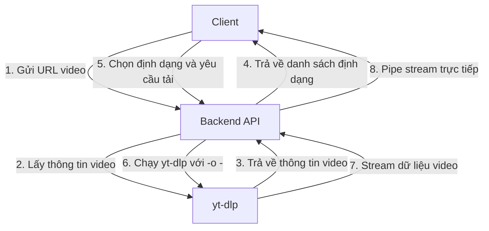

# Kế hoạch chuyển đổi hệ thống sang mô hình tải video trực tiếp (streaming) không lưu trữ server-side

## Tổng quan kiến trúc mới



## I. Sửa đổi Backend

### 1. Thêm hàm `streamVideoDirectly` vào utils/ytdlp.js

```javascript
/**
 * Stream video trực tiếp từ URL với định dạng đã chọn
 * @param {string} url - URL của video
 * @param {string} formatId - ID định dạng video
 * @param {string} qualityKey - Khóa chất lượng (tùy chọn)
 * @returns {Promise<ChildProcess>} - Promise chứa child process đang chạy yt-dlp
 */
exports.streamVideoDirectly = (url, formatId, qualityKey = null) => {
  return new Promise((resolve, reject) => {
    logDebug(`Streaming video directly from URL: ${url}`);
    logDebug(`Format ID/Quality: ${formatId}, Quality Key: ${qualityKey || 'not specified'}`);
    
    // Xác định các tham số tải xuống dựa trên formatId
    let downloadArgs = [];
    
    // Ưu tiên sử dụng qualityKey nếu có
    const effectiveQuality = qualityKey || formatId;
    console.log(`[YTDLP] Processing stream request for quality: ${effectiveQuality}`);
    
    // Kiểm tra xem formatId có phải là một trong các lựa chọn chất lượng đơn giản không
    if (effectiveQuality.match(/^\d+p$/)) {
      // Đây là lựa chọn độ phân giải (ví dụ: 720p, 1080p)
      const resolution = parseInt(effectiveQuality.replace('p', ''));
      logDebug(`Detected resolution-based quality: ${resolution}p`);
      console.log(`[YTDLP] Using resolution-based quality: ${resolution}p`);
      
      // Xây dựng format string chính xác để đảm bảo luôn có video và audio
      const formatString = `bv*[height<=${resolution}]+ba/b[height<=${resolution}]`;
      
      downloadArgs = [
        '-f', formatString,
        '--merge-output-format', 'mp4',
        '--remux-video', 'mp4', // Remux video thành MP4 nếu cần
        '--prefer-ffmpeg', // Đảm bảo sử dụng ffmpeg để ghép video và audio
        '-o', '-', // Output to stdout
        '--no-part', // Không tạo file .part
        '--no-playlist' // Không tải playlist
      ];
      
      console.log(`[YTDLP_STREAM_COMMAND] Using format string: ${formatString}`);
      console.log(`[YTDLP_STREAM_COMMAND] Ensuring video and audio are merged with ffmpeg`);
    } else if (effectiveQuality.startsWith('audio_')) {
      // Đây là lựa chọn chỉ âm thanh
      logDebug(`Detected audio-only format: ${effectiveQuality}`);
      console.log(`[YTDLP] Using audio-only format: ${effectiveQuality}`);
      
      // Xác định định dạng âm thanh
      let audioFormat = 'mp3';
      let audioBitrate = '128';
      
      const audioParts = effectiveQuality.split('_');
      if (audioParts.length >= 2) {
        audioFormat = audioParts[1] || 'mp3';
      }
      if (audioParts.length >= 3) {
        audioBitrate = audioParts[2] || '128';
      }
      
      console.log(`[YTDLP] Audio format: ${audioFormat}, bitrate: ${audioBitrate}K`);
      
      // Tải xuống âm thanh chất lượng tốt nhất và chuyển đổi sang định dạng mong muốn
      downloadArgs = [
        '-f', 'bestaudio',
        '--extract-audio',
        '--audio-format', audioFormat,
        '--audio-quality', `${audioBitrate}K`,
        '-o', '-', // Output to stdout
        '--no-playlist' // Không tải playlist
      ];
    } else if (effectiveQuality === 'best') {
      // Lựa chọn "Chất lượng tốt nhất có sẵn"
      logDebug('Using best available quality');
      console.log(`[YTDLP] Using best available quality`);
      
      downloadArgs = [
        '-f', 'bestvideo[ext=mp4]+bestaudio[ext=m4a]/best[ext=mp4]/best',
        '--merge-output-format', 'mp4',
        '-o', '-', // Output to stdout
        '--no-playlist' // Không tải playlist
      ];
    } else if (effectiveQuality.includes('+') || effectiveQuality.includes('/')) {
      // Đây là format ID phức tạp (có thể là bestvideo+bestaudio hoặc tương tự)
      logDebug(`Using complex format ID: ${effectiveQuality}`);
      console.log(`[YTDLP] Using complex format ID: ${effectiveQuality}`);
      
      downloadArgs = [
        '-f', effectiveQuality,
        '--merge-output-format', 'mp4',
        '-o', '-', // Output to stdout
        '--no-playlist' // Không tải playlist
      ];
    } else {
      // Sử dụng format ID cụ thể (tương thích với code cũ)
      logDebug(`Using specific format ID: ${effectiveQuality}`);
      console.log(`[YTDLP] Using specific format ID: ${effectiveQuality}`);
      
      downloadArgs = [
        '-f', effectiveQuality,
        '-o', '-', // Output to stdout
        '--no-playlist' // Không tải playlist
      ];
    }
    
    // Tìm đường dẫn đến ffmpeg
    let ffmpegPath = '';
    try {
      // Thử tìm ffmpeg trong hệ thống
      const whichCommand = process.platform === 'win32' ? 'where' : 'which';
      const ffmpegCheck = require('child_process').execSync(`${whichCommand} ffmpeg`, { encoding: 'utf8' }).trim();
      
      if (ffmpegCheck) {
        ffmpegPath = ffmpegCheck;
        console.log(`[YTDLP_FFMPEG] Found ffmpeg at: ${ffmpegPath}`);
        downloadArgs.push('--ffmpeg-location', ffmpegPath);
      }
    } catch (error) {
      console.log(`[YTDLP_WARNING] Could not find ffmpeg in PATH: ${error.message}`);
      
      // Thử một số đường dẫn phổ biến
      const commonPaths = [
        'C:\\ffmpeg\\bin\\ffmpeg.exe',
        'C:\\Program Files\\ffmpeg\\bin\\ffmpeg.exe',
        'C:\\Program Files (x86)\\ffmpeg\\bin\\ffmpeg.exe',
        '/usr/bin/ffmpeg',
        '/usr/local/bin/ffmpeg'
      ];
      
      for (const path of commonPaths) {
        if (fs.existsSync(path)) {
          ffmpegPath = path;
          console.log(`[YTDLP_FFMPEG] Found ffmpeg at common path: ${ffmpegPath}`);
          downloadArgs.push('--ffmpeg-location', ffmpegPath);
          break;
        }
      }
    }
    
    // Nếu không tìm thấy ffmpeg, ghi log cảnh báo
    if (!ffmpegPath) {
      console.log(`[YTDLP_WARNING] ffmpeg not found, video merging may fail`);
    }

    // Thêm các tham số chung
    const args = [
      url,
      ...downloadArgs
    ];
    
    const commandString = `python ${path.join(YT_DLP_PATH, 'yt_dlp/__main__.py')} ${args.join(' ')}`;
    logDebug(`Command: ${commandString}`);
    console.log(`[YTDLP_STREAM_COMMAND] Executing full command: ${commandString}`);
    
    // Sử dụng spawn với stdio: 'pipe' để có thể truy cập stdout và stderr
    const ytDlp = spawn('python', [path.join(YT_DLP_PATH, 'yt_dlp/__main__.py'), ...args], {
      stdio: ['ignore', 'pipe', 'pipe']
    });
    
    ytDlp.stderr.on('data', (data) => {
      const error = data.toString();
      logDebug(`stderr: ${error}`);
      console.log(`[YTDLP_ERROR] ${error.trim()}`);
    });
    
    ytDlp.on('error', (error) => {
      logDebug(`yt-dlp process error: ${error.message}`);
      console.error(`[YTDLP_PROCESS_ERROR] ${error.message}`);
      reject(error);
    });
    
    // Trả về child process để controller có thể pipe stdout
    resolve(ytDlp);
  });
};
```

### 2. Sửa đổi controllers/video.js

Thay thế hàm `streamVideo` hiện tại bằng phiên bản mới sử dụng streaming trực tiếp:

```javascript
/**
 * Stream video trực tiếp từ nguồn đến client
 */
exports.streamVideo = catchAsync(async (req, res, next) => {
  // Xử lý cả hai trường hợp: GET request với ID và POST request với thông tin đầy đủ
  let url, formatId, title, formatType, qualityKey;
  
  if (req.method === 'GET') {
    // Trường hợp GET /api/videos/:id/download (tương thích ngược)
    const videoId = req.params.id;
    console.log(`[${new Date().toISOString()}] [VIDEO_CONTROLLER] Stream video request for ID: ${videoId}`, {
      user: req.user ? { id: req.user.id, role: req.user.role } : 'anonymous',
      headers: req.headers
    });
    
    // Tìm thông tin video từ ID (nếu cần)
    try {
      const video = await Video.findById(videoId);
      if (!video) {
        return res.status(404).json({ success: false, message: 'Không tìm thấy video.' });
      }
      
      // Kiểm tra quyền truy cập
      if (video.user && (!req.user || (video.user.toString() !== req.user.id && req.user.role !== 'admin'))) {
        return res.status(403).json({ success: false, message: 'Không có quyền truy cập video này.' });
      }
      
      url = video.url;
      formatId = video.formatId;
      title = video.title;
    } catch (error) {
      console.error(`[${new Date().toISOString()}] [VIDEO_CONTROLLER] Error finding video:`, error);
      return res.status(500).json({ success: false, message: 'Lỗi khi tìm thông tin video.' });
    }
  } else {
    // Trường hợp POST /api/videos/stream hoặc POST /api/videos/download
    ({ url, formatId, title, formatType, qualityKey } = req.body);
  }
  
  // Giải mã HTML entities trong formatId
  formatId = decodeHtmlEntities(formatId);
  
  console.log(`[${new Date().toISOString()}] [VIDEO_CONTROLLER] Streaming video directly from URL: ${url}`, { 
    formatId, title, user: req.user ? req.user.id : 'anonymous' 
  });

  try {
    // Kiểm tra quyền truy cập và giới hạn tải xuống
    // Đây là phần kiểm tra quyền truy cập, có thể tái sử dụng logic từ videoService.downloadVideo
    // Nhưng vì chúng ta không lưu trữ bản ghi Video nữa, nên chỉ cần kiểm tra quyền truy cập
    
    // Kiểm tra giới hạn tải xuống cho người dùng đã đăng ký
    if (req.user && req.user.subscription !== 'premium') {
      req.user.resetDailyDownloadCount();
      const settings = await getSettings();
      
      if (req.user.dailyDownloadCount >= settings.maxDownloadsPerDay && req.user.bonusDownloads <= 0) {
        return res.status(403).json({ success: false, message: 'Đã đạt giới hạn tải hàng ngày. Nâng cấp hoặc mời bạn bè.' });
      }
      
      if (req.user.dailyDownloadCount >= settings.maxDownloadsPerDay && req.user.bonusDownloads > 0) {
        req.user.useBonusDownload();
        await req.user.save();
      }
    }
    
    // Lấy thông tin video để xác định tên file và loại file
    const videoInfo = await ytdlp.getVideoInfo(url);
    
    // Kiểm tra quyền truy cập định dạng
    const selectedFormatDetails = videoInfo.formats.find(f => f.format_id === formatId);
    if (!selectedFormatDetails) {
      return res.status(400).json({ success: false, message: 'Định dạng không hợp lệ.' });
    }
    
    // Kiểm tra quyền truy cập định dạng dựa trên loại người dùng
    const userType = req.user ? (req.user.subscription === 'premium' ? 'premium' : 'registered') : 'anonymous';
    const settings = await getSettings();
    
    let resolution = selectedFormatDetails.height || 0;
    if (!resolution && selectedFormatDetails.qualityKey && selectedFormatDetails.qualityKey.match(/^\d+p$/)) {
      resolution = parseInt(selectedFormatDetails.qualityKey.replace('p', ''));
    }
    
    let bitrate = selectedFormatDetails.abr || 0;
    if (!bitrate && selectedFormatDetails.type === 'audio' && selectedFormatDetails.qualityKey && selectedFormatDetails.qualityKey.toLowerCase().includes('kbps')) {
      const match = selectedFormatDetails.qualityKey.toLowerCase().match(/(\d+)\s*kbps/);
      if (match) bitrate = parseInt(match[1]);
    }
    
    let isFormatAllowedForUser = false;
    const isTikTok = url.includes('tiktok.com');
    
    if (userType === 'premium') {
      isFormatAllowedForUser = true;
    } else if (userType === 'registered') {
      if (selectedFormatDetails.type === 'video' && resolution <= (settings.freeUserMaxResolution || 1080)) {
        isFormatAllowedForUser = true;
      } else if (selectedFormatDetails.type === 'audio' && bitrate <= (settings.freeUserMaxAudioBitrate || 192)) {
        isFormatAllowedForUser = true;
      }
    } else { // anonymous
      const anonymousMaxVideo = isTikTok ? (settings.tiktokAnonymousMaxResolution || 1024) : (settings.anonymousMaxVideoResolution || 480);
      const anonymousMaxAudio = settings.anonymousMaxAudioBitrate || 128;
      
      if (selectedFormatDetails.type === 'video') {
        if (resolution <= anonymousMaxVideo) {
          isFormatAllowedForUser = true;
        }
      } else if (selectedFormatDetails.type === 'audio') {
        if (bitrate <= anonymousMaxAudio) {
          isFormatAllowedForUser = true;
        }
      }
    }
    
    if (!isFormatAllowedForUser) {
      return res.status(403).json({ success: false, message: 'Bạn không có quyền tải định dạng này.' });
    }
    
    // Xác định tên file và loại file
    const videoTitle = title || videoInfo.title || 'video';
    const safeTitle = videoTitle.replace(/[/\\?%*:|"<>]/g, '-').replace(/\s+/g, ' ');
    
    // Xác định loại file dựa trên định dạng đã chọn
    let fileExtension = 'mp4'; // Mặc định
    let mimeType = 'video/mp4';
    
    if (selectedFormatDetails.ext) {
      fileExtension = selectedFormatDetails.ext;
    } else if (selectedFormatDetails.type === 'audio') {
      fileExtension = 'mp3';
      mimeType = 'audio/mpeg';
    }
    
    // Xác định MIME type dựa trên phần mở rộng file
    mimeType = getMimeType(`.${fileExtension}`);
    
    // Thiết lập headers cho response
    res.setHeader('Content-Type', mimeType);
    res.setHeader('Content-Disposition', `attachment; filename="${encodeURIComponent(safeTitle)}.${fileExtension}"`);
    res.setHeader('Cache-Control', 'no-cache, no-store, must-revalidate');
    res.setHeader('Pragma', 'no-cache');
    res.setHeader('Expires', '0');
    
    // Gọi hàm streamVideoDirectly để lấy child process
    const ytDlpProcess = await ytdlp.streamVideoDirectly(url, formatId, qualityKey);
    
    // Pipe stdout của yt-dlp vào response
    ytDlpProcess.stdout.pipe(res);
    
    // Xử lý lỗi từ stderr
    ytDlpProcess.stderr.on('data', (data) => {
      console.error(`[${new Date().toISOString()}] [YTDLP_STDERR]: ${data.toString()}`);
      // Không gửi response lỗi ở đây nếu header đã được gửi, nhưng cần log lại
    });
    
    // Xử lý lỗi từ process
    ytDlpProcess.on('error', (error) => {
      console.error(`[${new Date().toISOString()}] [YTDLP_PROCESS_ERROR]`, error);
      if (!res.headersSent) {
        res.status(500).json({ success: false, message: 'Lỗi khi xử lý video từ nguồn.' });
      } else {
        // Nếu header đã gửi, chỉ có thể cố gắng kết thúc stream một cách đột ngột
        res.end();
      }
    });
    
    // Xử lý khi process kết thúc
    ytDlpProcess.on('close', (code) => {
      if (code !== 0) {
        console.error(`[${new Date().toISOString()}] [YTDLP_PROCESS_CLOSE] yt-dlp exited with code ${code}`);
        if (!res.headersSent) {
          res.status(500).json({ success: false, message: 'Lỗi khi tải video từ nguồn.' });
        }
      }
      console.log(`[${new Date().toISOString()}] [YTDLP_PROCESS_CLOSE] Stream finished for URL: ${url}`);
      if (!res.writableEnded) { // Đảm bảo response được kết thúc nếu yt-dlp kết thúc mà chưa gửi hết
        res.end();
      }
    });
    
    // Xử lý client ngắt kết nối
    req.on('close', () => {
      console.log(`[${new Date().toISOString()}] [CLIENT_DISCONNECT] Client disconnected, killing yt-dlp process.`);
      ytDlpProcess.kill('SIGKILL'); // Hoặc SIGTERM
    });
    
    // Cập nhật thống kê tải xuống (nếu cần)
    if (req.user) {
      User.findByIdAndUpdate(req.user.id, {
        $inc: { downloadCount: 1, dailyDownloadCount: 1 },
        lastDownloadDate: new Date()
      }).catch(err => console.error(`[${new Date().toISOString()}] Error updating user stats:`, err));
    }
    
    // Log thông tin tải xuống cho mục đích thống kê
    console.log(`[${new Date().toISOString()}] [DOWNLOAD_STATS] User: ${req.user ? req.user.id : 'anonymous'}, URL: ${url}, Format: ${formatId}, Title: ${title}`);
    
  } catch (error) {
    console.error(`[${new Date().toISOString()}] [VIDEO_CONTROLLER] Error streaming video:`, error);
    if (!res.headersSent) {
      res.status(500).json({ success: false, message: error.message || 'Lỗi khi xử lý video.' });
    }
  }
});
```

### 3. Sửa đổi routes/video.js

Thêm route mới cho streaming trực tiếp và giữ lại route cũ:

```javascript
// Route mới cho streaming trực tiếp
router.post('/stream',
  sanitizeData,
  videoUrlValidation,
  optionalAuth,
  downloadLimiter,
  streamVideo
);

// Giữ lại route cũ nhưng sử dụng logic mới
router.get('/:id/download', optionalAuth, streamVideo);
```

### 4. Sửa đổi hàm downloadVideo trong controllers/video.js

Sửa đổi hàm `downloadVideo` để sử dụng streaming trực tiếp thay vì lưu trữ file:

```javascript
/**
 * Bắt đầu quá trình tải xuống video
 */
exports.downloadVideo = catchAsync(async (req, res, next) => {
  // Chuyển hướng đến hàm streamVideo để xử lý trực tiếp
  return streamVideo(req, res, next);
});
```

## II. Sửa đổi Frontend

### 1. Sửa đổi VideoDownloadPage.js

Sửa đổi hàm `handleDownload` để sử dụng API streaming trực tiếp:

```javascript
const handleDownload = useCallback(async () => {
  if (!url) {
    setError('Vui lòng nhập URL video');
    return;
  }
  
  if (!selectedFormat) {
    setError('Vui lòng chọn định dạng video');
    return;
  }
  
  setLoading(true);
  setError(null);
  
  // Tìm định dạng được chọn để lấy thông tin qualityKey
  const selectedFormatObj = videoInfo?.formats?.find(format => format.format_id === selectedFormat);
  
  // Tạo payload cho yêu cầu tải xuống
  const payload = {
    url: url, // Sử dụng URL gốc mà người dùng đã nhập
    formatId: selectedFormat,
    title: videoInfo?.title,
    formatType: currentFormatType, // Thêm thông tin về loại định dạng (video hoặc audio)
    qualityKey: selectedFormatObj?.qualityKey || '' // Thêm qualityKey để backend có thể xác định độ phân giải
  };
  
  // Log payload để debug
  console.log('Download request payload:', payload);
  console.log('Current format type:', currentFormatType);
  console.log('Selected format details:', selectedFormatObj);
  
  try {
    console.log('Starting direct stream download with format:', selectedFormat);
    
    // Tạo form để submit
    const form = document.createElement('form');
    form.method = 'POST';
    form.action = '/api/videos/stream';
    form.style.display = 'none';
    
    // Thêm các trường input
    Object.keys(payload).forEach(key => {
      const input = document.createElement('input');
      input.type = 'hidden';
      input.name = key;
      input.value = payload[key];
      form.appendChild(input);
    });
    
    // Thêm form vào document và submit
    document.body.appendChild(form);
    form.submit();
    
    // Dọn dẹp
    setTimeout(() => {
      document.body.removeChild(form);
      setLoading(false);
    }, 1000);
    
  } catch (error) {
    console.error('Lỗi khi tải video:', error);
    // Log chi tiết lỗi để debug
    if (error.response) {
      console.error('Error response:', error.response.data);
      console.error('Error status:', error.response.status);
    }
    setError(
      error.response?.data?.message ||
      'Không thể tải video. Vui lòng thử lại sau.'
    );
    setLoading(false);
  }
}, [url, selectedFormat, videoInfo, currentFormatType]);
```

### 2. Sửa đổi DashboardPage.js

Vì chúng ta không còn lưu trữ bản ghi Video trong cơ sở dữ liệu, chúng ta cần điều chỉnh DashboardPage.js để hiển thị thông tin tải xuống từ nguồn khác (ví dụ: log). Tuy nhiên, vì yêu cầu là chỉ cần log các thông tin cần thiết cho mục đích thống kê, chúng ta có thể đơn giản hóa DashboardPage.js để không hiển thị lịch sử tải xuống nữa.

Nếu vẫn muốn giữ lại chức năng hiển thị lịch sử tải xuống, chúng ta có thể tạo một bảng đơn giản trong cơ sở dữ liệu để lưu trữ thông tin tải xuống (không bao gồm đường dẫn file).

## III. Kế hoạch triển khai

1. **Giai đoạn 1: Phát triển và kiểm thử**
   - Thêm hàm `streamVideoDirectly` vào utils/ytdlp.js
   - Sửa đổi hàm `streamVideo` trong controllers/video.js
   - Thêm route `/api/videos/stream` vào routes/video.js
   - Kiểm thử API mới với các loại video và định dạng khác nhau

2. **Giai đoạn 2: Cập nhật frontend**
   - Sửa đổi hàm `handleDownload` trong VideoDownloadPage.js
   - Sửa đổi DashboardPage.js để phản ánh thay đổi trong lưu trữ dữ liệu

3. **Giai đoạn 3: Triển khai và theo dõi**
   - Triển khai các thay đổi lên môi trường staging
   - Kiểm thử kỹ lưỡng với các nền tảng và chất lượng khác nhau
   - Theo dõi log và hiệu suất hệ thống
   - Triển khai lên môi trường production

4. **Giai đoạn 4: Dọn dẹp và tối ưu hóa**
   - Xóa mã không sử dụng
   - Tối ưu hóa hiệu suất streaming
   - Cải thiện xử lý lỗi và logging

## IV. Lợi ích của kiến trúc mới

1. **Giảm chi phí lưu trữ**: Không còn lưu trữ file video trên server
2. **Đơn giản hóa hệ thống**: Không cần quản lý và dọn dẹp file tạm
3. **Tương thích với ephemeral filesystem**: Hoạt động tốt trên các nền tảng đám mây với hệ thống file tạm thời
4. **Giảm độ trễ**: Người dùng không cần đợi video được tải xuống và xử lý trên server trước khi tải về
5. **Tiết kiệm băng thông**: Dữ liệu chỉ được truyền một lần từ nguồn đến người dùng, thay vì hai lần (nguồn -> server -> người dùng)