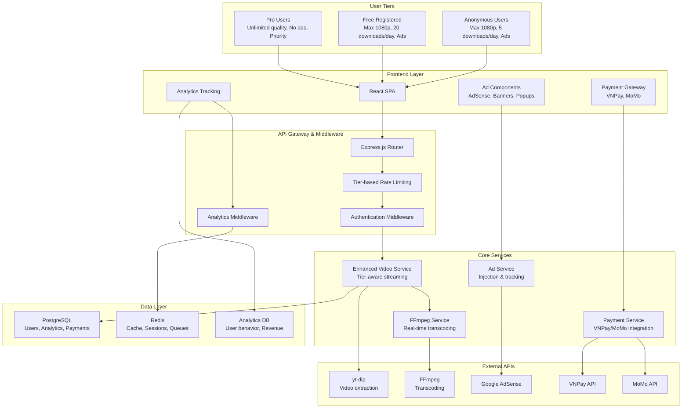

# Kế hoạch Nâng cấp VideoDownloader SaaS - Streaming Architecture & Business Model Transformation

## 📋 Executive Summary

### Mục tiêu chính
Chuyển đổi VideoDownloader SaaS từ mô hình lưu trữ file sang **streaming architecture** hoàn toàn, đồng thời xây dựng mô hình kinh doanh bền vững với 3 tiers người dùng và hệ thống monetization đa dạng.

### Business Impact dự kiến
- **Revenue target**: $2,000-5,000/tháng sau 6 tháng
- **User acquisition**: 1,000+ active users/tháng
- **Cost reduction**: 60% giảm storage costs
- **Performance improvement**: 80% faster download speeds

---

## 🏗️ Current Architecture Analysis

### Điểm mạnh hiện tại
✅ **Streaming foundation**: Đã có `streamVideo` function cơ bản  
✅ **Database flexibility**: Hỗ trợ SQLite và PostgreSQL  
✅ **Authentication**: JWT-based auth hoàn chỉnh  
✅ **Rate limiting**: Middleware cho download limits  
✅ **Referral system**: Cơ bản với referral codes  
✅ **Multi-platform**: React frontend + Node.js backend  

### Technical Debt & Limitations
❌ **Inconsistent streaming**: Một số endpoints vẫn lưu file  
❌ **Limited user tiers**: Chỉ có free/premium  
❌ **No monetization**: Chưa có ads hoặc payment gateway  
❌ **Basic analytics**: Thiếu user behavior tracking  
❌ **No FFmpeg integration**: Thiếu real-time transcoding  
❌ **SQLite dependency**: Cần migrate hoàn toàn sang PostgreSQL  

---

## 🎯 Target Architecture Design

### System Architecture Overview



### Database Schema Transformation

#### New User Tier System
```sql
-- Enum cho user tiers
CREATE TYPE user_tier AS ENUM ('anonymous', 'free', 'pro');
CREATE TYPE subscription_status AS ENUM ('active', 'expired', 'cancelled');

-- Cập nhật Users table
ALTER TABLE Users ADD COLUMN tier user_tier DEFAULT 'free';
ALTER TABLE Users ADD COLUMN subscription_expires_at TIMESTAMP;
ALTER TABLE Users ADD COLUMN monthly_download_count INTEGER DEFAULT 0;
ALTER TABLE Users ADD COLUMN last_reset_date DATE DEFAULT CURRENT_DATE;
ALTER TABLE Users ADD COLUMN total_revenue_generated DECIMAL(10,2) DEFAULT 0;

-- Analytics table
CREATE TABLE user_analytics (
    id SERIAL PRIMARY KEY,
    user_id INTEGER REFERENCES Users(id),
    session_id VARCHAR(255) NOT NULL,
    ip_address INET,
    user_agent TEXT,
    page_views INTEGER DEFAULT 0,
    downloads_count INTEGER DEFAULT 0,
    time_spent_seconds INTEGER DEFAULT 0,
    revenue_generated DECIMAL(10,2) DEFAULT 0,
    created_at TIMESTAMP DEFAULT NOW(),
    updated_at TIMESTAMP DEFAULT NOW()
);

-- Ad impressions tracking
CREATE TABLE ad_impressions (
    id SERIAL PRIMARY KEY,
    user_id INTEGER REFERENCES Users(id),
    session_id VARCHAR(255),
    ad_type VARCHAR(50) NOT NULL, -- 'banner', 'video', 'popup', 'affiliate'
    ad_position VARCHAR(50), -- 'header', 'sidebar', 'pre-download'
    impressions INTEGER DEFAULT 0,
    clicks INTEGER DEFAULT 0,
    revenue DECIMAL(10,2) DEFAULT 0,
    created_at TIMESTAMP DEFAULT NOW()
);

-- Payment transactions
CREATE TABLE payment_transactions (
    id SERIAL PRIMARY KEY,
    user_id INTEGER REFERENCES Users(id) NOT NULL,
    transaction_id VARCHAR(255) UNIQUE NOT NULL,
    payment_method VARCHAR(50) NOT NULL, -- 'vnpay', 'momo'
    amount DECIMAL(10,2) NOT NULL,
    currency VARCHAR(3) DEFAULT 'VND',
    status VARCHAR(50) NOT NULL, -- 'pending', 'completed', 'failed', 'refunded'
    subscription_months INTEGER DEFAULT 1,
    vnpay_data JSONB,
    momo_data JSONB,
    created_at TIMESTAMP DEFAULT NOW(),
    updated_at TIMESTAMP DEFAULT NOW()
);

-- Download history với analytics
CREATE TABLE download_history (
    id SERIAL PRIMARY KEY,
    user_id INTEGER REFERENCES Users(id),
    session_id VARCHAR(255),
    video_url TEXT NOT NULL,
    video_title VARCHAR(500),
    format_id VARCHAR(100),
    quality VARCHAR(50),
    file_size_mb DECIMAL(10,2),
    download_duration_seconds INTEGER,
    user_tier user_tier NOT NULL,
    revenue_generated DECIMAL(10,2) DEFAULT 0,
    created_at TIMESTAMP DEFAULT NOW()
);
```

---

## 📅 Implementation Roadmap

### Phase 1: Database Migration & Core Infrastructure (Tuần 1-2)

#### Week 1: PostgreSQL Migration
**Mục tiêu**: Chuyển đổi hoàn toàn từ SQLite sang PostgreSQL

**Tasks**:
- [ ] Tạo migration scripts cho schema mới
- [ ] Cập nhật database.js để loại bỏ SQLite
- [ ] Migrate existing data (nếu có)
- [ ] Update all models với new fields
- [ ] Test database connections và performance

**Deliverables**:
```javascript
// database/migrations/001_user_tier_system.js
exports.up = async (knex) => {
  // Create enums
  await knex.raw(`CREATE TYPE user_tier AS ENUM ('anonymous', 'free', 'pro')`);
  
  // Alter Users table
  await knex.schema.alterTable('Users', (table) => {
    table.enu('tier', ['anonymous', 'free', 'pro']).defaultTo('free');
    table.timestamp('subscription_expires_at').nullable();
    table.integer('monthly_download_count').defaultTo(0);
    table.date('last_reset_date').defaultTo(knex.fn.now());
    table.decimal('total_revenue_generated', 10, 2).defaultTo(0);
  });
};
```

#### Week 2: Enhanced Models
**Tasks**:
- [ ] Create UserAnalytics model
- [ ] Create AdImpression model  
- [ ] Create PaymentTransaction model
- [ ] Create DownloadHistory model
- [ ] Update relationships và associations

### Phase 2: Enhanced Streaming Architecture (Tuần 3-5)

#### Week 3: FFmpeg Integration
**Mục tiêu**: Tích hợp FFmpeg cho real-time transcoding

**Tasks**:
- [ ] Install FFmpeg trên server
- [ ] Tạo FFmpegService class
- [ ] Implement real-time transcoding
- [ ] Quality optimization based on user tier
- [ ] Error handling và fallback mechanisms

**Implementation**:
```javascript
// services/ffmpegService.js
class FFmpegService {
  constructor() {
    this.ffmpegPath = process.env.FFMPEG_PATH || 'ffmpeg';
  }

  async transcodeStream(inputStream, options = {}) {
    const {
      outputFormat = 'mp4',
      quality = 'medium',
      resolution = null,
      audioBitrate = '128k'
    } = options;

    const ffmpegArgs = [
      '-i', 'pipe:0', // Input từ stdin
      '-f', outputFormat,
      '-movflags', 'frag_keyframe+empty_moov', // Cho streaming
      '-preset', 'ultrafast', // Tốc độ encode nhanh
      '-crf', this.getQualityCRF(quality),
    ];

    if (resolution) {
      ffmpegArgs.push('-vf', `scale=${resolution}`);
    }

    ffmpegArgs.push('-acodec', 'aac', '-ab', audioBitrate);
    ffmpegArgs.push('pipe:1'); // Output to stdout

    return spawn(this.ffmpegPath, ffmpegArgs);
  }

  getQualityCRF(quality) {
    const qualityMap = {
      'low': '28',
      'medium': '23', 
      'high': '18',
      'ultra': '15'
    };
    return qualityMap[quality] || '23';
  }

  async optimizeForMobile(inputStream) {
    return this.transcodeStream(inputStream, {
      resolution: '720:-2',
      quality: 'medium',
      audioBitrate: '96k'
    });
  }
}
```

#### Week 4-5: Enhanced Video Service
**Tasks**:
- [ ] Refactor videoService với tier-aware logic
- [ ] Implement format filtering based on user tier
- [ ] Add analytics tracking to all video operations
- [ ] Optimize streaming performance
- [ ] Add concurrent download limits

**Implementation**:
```javascript
// services/enhancedVideoService.js
class EnhancedVideoService {
  constructor() {
    this.ffmpegService = new FFmpegService();
    this.analyticsService = new AnalyticsService();
  }

  async getVideoInfoWithTierRestrictions(url, user, sessionId) {
    const videoInfo = await ytdlp.getVideoInfo(url);
    const userTier = this.getUserTier(user);
    
    // Filter formats based on tier
    const allowedFormats = this.filterFormatsByTier(videoInfo.formats, userTier);
    
    // Track analytics
    await this.analyticsService.trackVideoInfo(user?.id, sessionId, url);
    
    return {
      ...videoInfo,
      formats: allowedFormats,
      tierRestrictions: this.getTierRestrictions(userTier)
    };
  }

  filterFormatsByTier(formats, tier) {
    const restrictions = TIER_RESTRICTIONS[tier];
    
    return formats.filter(format => {
      // Check resolution limits
      if (format.height && format.height > restrictions.maxResolution) {
        return false;
      }
      
      // Check format type restrictions
      if (!restrictions.allowedFormats.includes(format.ext)) {
        return false;
      }
      
      return true;
    });
  }

  async streamWithAnalytics(url, formatId, user, sessionId, res) {
    const userTier = this.getUserTier(user);
    const startTime = Date.now();
    
    try {
      // Check tier limits
      await this.checkTierLimits(user, userTier);
      
      // Inject ads for non-pro users
      if (userTier !== 'pro') {
        await this.adService.injectPreDownloadAd(res, userTier);
      }
      
      // Start streaming
      const ytDlpProcess = await ytdlp.streamVideoDirectly(url, formatId);
      
      // Apply transcoding if needed
      let outputStream = ytDlpProcess.stdout;
      if (this.needsTranscoding(formatId, userTier)) {
        const ffmpegProcess = await this.ffmpegService.transcodeStream(
          ytDlpProcess.stdout,
          this.getTranscodingOptions(userTier)
        );
        outputStream = ffmpegProcess.stdout;
      }
      
      // Pipe to response
      outputStream.pipe(res);
      
      // Track download completion
      outputStream.on('end', async () => {
        const duration = Date.now() - startTime;
        await this.analyticsService.trackDownloadComplete(
          user?.id, sessionId, url, formatId, duration
        );
        
        // Update user stats
        if (user) {
          await this.updateUserDownloadStats(user);
        }
      });
      
    } catch (error) {
      await this.analyticsService.trackDownloadError(
        user?.id, sessionId, url, error.message
      );
      throw error;
    }
  }
}
```

### Phase 3: User Tiers & Monetization (Tuần 6-8)

#### Week 6: Tier System Implementation
**Mục tiêu**: Triển khai hệ thống 3 tiers người dùng

**Tier Specifications**:
```javascript
// config/tierConfig.js
const TIER_RESTRICTIONS = {
  anonymous: {
    maxResolution: 1080,
    dailyDownloads: 5,
    allowedFormats: ['mp4', 'mp3'],
    showAds: true,
    concurrentDownloads: 1,
    priority: 'low'
  },
  free: {
    maxResolution: 1080,
    dailyDownloads: 20,
    allowedFormats: ['mp4', 'mp3', 'webm'],
    showAds: true,
    concurrentDownloads: 2,
    priority: 'normal'
  },
  pro: {
    maxResolution: Infinity, // 4K, 8K unlimited
    dailyDownloads: Infinity,
    allowedFormats: 'all',
    showAds: false,
    concurrentDownloads: 5,
    priority: 'high',
    features: ['batch_download', 'playlist_download', 'subtitle_download']
  }
};
```

**Tasks**:
- [ ] Implement tier middleware
- [ ] Create tier upgrade/downgrade logic
- [ ] Add tier-based rate limiting
- [ ] Update frontend để hiển thị tier restrictions
- [ ] Test tier switching scenarios

#### Week 7-8: Ad System Integration
**Mục tiêu**: Tích hợp hệ thống quảng cáo cho anonymous và free users

**Ad Types Implementation**:
```javascript
// services/adService.js
class AdService {
  async injectBannerAd(response, userTier, position) {
    if (userTier === 'pro') return;
    
    const adConfig = await this.getAdConfig(position);
    const adHtml = await this.generateAdHtml(adConfig);
    
    // Inject ad into response
    response.locals.ads = response.locals.ads || [];
    response.locals.ads.push({
      position,
      html: adHtml,
      type: 'banner'
    });
    
    // Track impression
    await this.trackAdImpression(userTier, 'banner', position);
  }

  async showPreDownloadAd(userTier) {
    if (userTier === 'pro') return null;
    
    const adTypes = ['video', 'popup', 'affiliate'];
    const selectedType = this.selectAdType(userTier);
    
    const adContent = await this.getAdContent(selectedType);
    await this.trackAdImpression(userTier, selectedType, 'pre-download');
    
    return adContent;
  }

  async injectAffiliatePopup(userTier, downloadUrl) {
    if (userTier === 'pro') return;
    
    const affiliateOffers = await this.getAffiliateOffers();
    const selectedOffer = this.selectBestOffer(affiliateOffers);
    
    return {
      type: 'affiliate_popup',
      title: 'Tải nhanh hơn với ứng dụng di động!',
      description: selectedOffer.description,
      ctaUrl: selectedOffer.url,
      revenue: selectedOffer.commission
    };
  }
}
```

### Phase 4: Payment Integration (Tuần 9-11)

#### Week 9: VNPay Integration
**Mục tiêu**: Tích hợp VNPay cho thanh toán Pro subscription

**Implementation**:
```javascript
// services/vnpayService.js
class VNPayService {
  constructor() {
    this.vnpUrl = process.env.VNPAY_URL;
    this.tmnCode = process.env.VNPAY_TMN_CODE;
    this.secretKey = process.env.VNPAY_SECRET_KEY;
    this.returnUrl = process.env.VNPAY_RETURN_URL;
  }

  async createPaymentUrl(userId, amount = 99000, months = 1) {
    const orderId = `PRO_${userId}_${Date.now()}`;
    const orderInfo = `Nang cap Pro ${months} thang`;
    
    const vnpParams = {
      vnp_Version: '2.1.0',
      vnp_Command: 'pay',
      vnp_TmnCode: this.tmnCode,
      vnp_Amount: amount * 100, // VNPay expects amount in VND cents
      vnp_CurrCode: 'VND',
      vnp_TxnRef: orderId,
      vnp_OrderInfo: orderInfo,
      vnp_OrderType: 'other',
      vnp_Locale: 'vn',
      vnp_ReturnUrl: this.returnUrl,
      vnp_IpAddr: '127.0.0.1',
      vnp_CreateDate: this.formatDate(new Date())
    };

    // Create secure hash
    const signData = this.createSignData(vnpParams);
    vnpParams.vnp_SecureHash = this.createSecureHash(signData);

    // Save transaction record
    await PaymentTransaction.create({
      userId,
      transactionId: orderId,
      paymentMethod: 'vnpay',
      amount,
      status: 'pending',
      subscriptionMonths: months,
      vnpayData: vnpParams
    });

    return this.vnpUrl + '?' + new URLSearchParams(vnpParams).toString();
  }

  async verifyPayment(vnpayResponse) {
    const { vnp_TxnRef, vnp_ResponseCode, vnp_SecureHash } = vnpayResponse;
    
    // Verify secure hash
    const isValidHash = this.verifySecureHash(vnpayResponse);
    if (!isValidHash) {
      throw new Error('Invalid payment signature');
    }

    // Find transaction
    const transaction = await PaymentTransaction.findOne({
      where: { transactionId: vnp_TxnRef }
    });

    if (!transaction) {
      throw new Error('Transaction not found');
    }

    // Update transaction status
    if (vnp_ResponseCode === '00') {
      transaction.status = 'completed';
      await transaction.save();

      // Upgrade user to Pro
      await this.upgradeUserToPro(transaction.userId, transaction.subscriptionMonths);
      
      return { success: true, transaction };
    } else {
      transaction.status = 'failed';
      await transaction.save();
      
      return { success: false, error: 'Payment failed' };
    }
  }

  async upgradeUserToPro(userId, months) {
    const user = await User.findByPk(userId);
    if (!user) throw new Error('User not found');

    const now = new Date();
    const expiresAt = new Date(now.getTime() + (months * 30 * 24 * 60 * 60 * 1000));

    user.tier = 'pro';
    user.subscription_expires_at = expiresAt;
    await user.save();

    // Track revenue
    await this.analyticsService.trackRevenue(userId, 99000 * months, 'vnpay');
  }
}
```

#### Week 10: MoMo Integration
**Tasks**:
- [ ] Implement MoMo payment service
- [ ] Add payment method selection UI
- [ ] Test payment flows
- [ ] Add payment history tracking

#### Week 11: Subscription Management
**Tasks**:
- [ ] Auto-renewal system
- [ ] Subscription expiry handling
- [ ] Downgrade logic (Pro → Free)
- [ ] Payment failure handling
- [ ] Refund processing

### Phase 5: Analytics & Tracking (Tuần 12-13)

#### Week 12: User Analytics Implementation
**Mục tiêu**: Triển khai hệ thống analytics toàn diện

**Implementation**:
```javascript
// services/analyticsService.js
class AnalyticsService {
  async trackPageView(userId, sessionId, page, userAgent, ipAddress) {
    await UserAnalytics.upsert({
      user_id: userId,
      session_id: sessionId,
      ip_address: ipAddress,
      user_agent: userAgent,
      page_views: sequelize.literal('page_views + 1'),
      updated_at: new Date()
    });
  }

  async trackDownloadStart(userId, sessionId, videoUrl, format) {
    await DownloadHistory.create({
      user_id: userId,
      session_id: sessionId,
      video_url: videoUrl,
      format_id: format,
      user_tier: await this.getUserTier(userId)
    });
  }

  async trackDownloadComplete(userId, sessionId, videoUrl, formatId, duration) {
    const download = await DownloadHistory.findOne({
      where: { user_id: userId, session_id: sessionId, video_url: videoUrl }
    });

    if (download) {
      download.download_duration_seconds = Math.floor(duration / 1000);
      await download.save();
    }

    // Update user analytics
    await UserAnalytics.upsert({
      user_id: userId,
      session_id: sessionId,
      downloads_count: sequelize.literal('downloads_count + 1'),
      updated_at: new Date()
    });
  }

  async trackRevenue(userId, amount, source) {
    await UserAnalytics.upsert({
      user_id: userId,
      revenue_generated: sequelize.literal(`revenue_generated + ${amount}`),
      updated_at: new Date()
    });

    // Update user total revenue
    const user = await User.findByPk(userId);
    if (user) {
      user.total_revenue_generated += amount;
      await user.save();
    }
  }

  async generateDashboardStats() {
    const stats = await sequelize.query(`
      SELECT 
        COUNT(DISTINCT u.id) as total_users,
        COUNT(DISTINCT CASE WHEN u.tier = 'pro' THEN u.id END) as pro_users,
        COUNT(DISTINCT CASE WHEN u.tier = 'free' THEN u.id END) as free_users,
        SUM(u.total_revenue_generated) as total_revenue,
        COUNT(DISTINCT dh.id) as total_downloads,
        AVG(dh.download_duration_seconds) as avg_download_time
      FROM Users u
      LEFT JOIN download_history dh ON u.id = dh.user_id
      WHERE u.created_at >= NOW() - INTERVAL '30 days'
    `, { type: QueryTypes.SELECT });

    return stats[0];
  }
}
```

#### Week 13: Revenue Analytics & Reporting
**Tasks**:
- [ ] Revenue tracking dashboard
- [ ] User behavior analytics
- [ ] A/B testing framework
- [ ] Performance monitoring
- [ ] Business intelligence reports

### Phase 6: Enhanced Features & Optimization (Tuần 14-16)

#### Week 14: Referral System Enhancement
**Mục tiêu**: Nâng cấp hệ thống referral với rewards hấp dẫn

**Enhanced Referral Logic**:
```javascript
// services/referralService.js
class ReferralService {
  async processSuccessfulReferral(referrerId, newUserId, eventType) {
    const referrer = await User.findByPk(referrerId);
    if (!referrer) return;

    let reward = null;

    switch (eventType) {
      case 'registration':
        // Tặng 5 lượt download bonus
        reward = { type: 'bonus_downloads', amount: 5 };
        referrer.bonusDownloads += 5;
        break;
        
      case 'pro_purchase':
        // Tặng 1 tháng Pro miễn phí
        reward = { type: 'pro_extension', months: 1 };
        const currentExpiry = referrer.subscription_expires_at || new Date();
        const newExpiry = new Date(currentExpiry.getTime() + (30 * 24 * 60 * 60 * 1000));
        referrer.subscription_expires_at = newExpiry;
        if (referrer.tier !== 'pro') {
          referrer.tier = 'pro';
        }
        break;
    }

    await referrer.save();

    // Update referral stats
    const stats = referrer.referralStats || { totalReferred: 0, successfulReferrals: 0 };
    stats.totalReferred += 1;
    if (eventType === 'pro_purchase') {
      stats.successfulReferrals += 1;
    }
    referrer.referralStats = stats;
    await referrer.save();

    // Track analytics
    await this.analyticsService.trackReferralReward(referrerId, newUserId, reward);

    return reward;
  }

  async generateReferralLink(userId) {
    const user = await User.findByPk(userId);
    if (!user) throw new Error('User not found');

    const baseUrl = process.env.FRONTEND_URL;
    return `${baseUrl}/register?ref=${user.referralCode}`;
  }

  async getReferralStats(userId) {
    const user = await User.findByPk(userId);
    const referrals = await User.findAll({
      where: { referredBy: userId },
      attributes: ['id', 'name', 'tier', 'createdAt']
    });

    const proReferrals = referrals.filter(r => r.tier === 'pro').length;
    const totalEarnings = proReferrals * 99000; // Assuming 99k per pro referral

    return {
      totalReferrals: referrals.length,
      proReferrals,
      totalEarnings,
      referralCode: user.referralCode,
      referralLink: await this.generateReferralLink(userId),
      recentReferrals: referrals.slice(0, 10)
    };
  }
}
```

#### Week 15: Performance Optimization
**Tasks**:
- [ ] CDN integration cho static assets
- [ ] Database query optimization
- [ ] Caching strategy implementation
- [ ] Load balancing setup
- [ ] Memory usage optimization

#### Week 16: Security & Compliance
**Tasks**:
- [ ] DMCA compliance system
- [ ] Rate limiting enhancements
- [ ] Security audit
- [ ] GDPR compliance
- [ ] Penetration testing

---

## 💰 Revenue Model & Financial Projections

### Revenue Streams

#### 1. Pro Subscriptions (Primary)
- **Price**: 99.000 VND/tháng (~$4.2 USD)
- **Target**: 100 Pro users sau 3 tháng, 300 sau 6 tháng
- **Monthly Revenue**: 9.9M - 29.7M VND ($420 - $1,260 USD)

#### 2. Advertising Revenue (Secondary)
- **Google AdSense**: $0.5-2 per 1000 impressions
- **Affiliate Marketing**: 5-15% commission
- **Banner Ads**: $10-50 per 1000 impressions
- **Estimated Monthly**: $200-800 USD

#### 3. Referral Commissions (Bonus)
- **Affiliate programs**: 10-20% commission
- **Estimated Monthly**: $100-300 USD

### Cost Analysis

#### Development Costs (One-time)
- **Phase 1-2**: 40 hours × $50/hour = $2,000
- **Phase 3-4**: 60 hours × $50/hour = $3,000  
- **Phase 5-6**: 40 hours × $50/hour = $2,000
- **Total Development**: $7,000

#### Operational Costs (Monthly)
- **Easypanel Hosting**: $50-100
- **CDN (Cloudflare)**: $20-50
- **Database (PostgreSQL)**: $25-50
- **Redis Cache**: $15-30
- **Payment Gateway Fees**: 2.9% of revenue
- **Total Monthly**: $110-230 + payment fees

### Break-even Analysis

**Month 1-3**: Development phase, negative ROI  
**Month 4**: 50 Pro users = $210 revenue - $150 costs = $60 profit  
**Month 6**: 150 Pro users = $630 revenue - $200 costs = $430 profit  
**Month 12**: 500 Pro users = $2,100 revenue - $300 costs = $1,800 profit  

**ROI Timeline**: Break-even tại tháng 4, positive cash flow từ tháng 6

---

## 🔒 Security & Compliance Strategy

### DMCA Compliance
```javascript
// services/dmcaService.js
class DMCAService {
  async checkCopyrightStatus(videoUrl) {
    // Check against known copyright databases
    // Implement automated takedown for flagged content
  }

  async handleTakedownRequest(videoUrl, requestDetails) {
    // Process DMCA takedown requests
    // Block access to copyrighted content
    // Notify users about restrictions
  }
}
```

### Data Privacy (GDPR)
- **User consent**: Explicit consent cho analytics tracking
- **Data retention**: Auto-delete user data sau 2 năm inactive
- **Right to deletion**: API endpoint cho user data deletion
- **Data portability**: Export user data functionality

### Security Measures
- **Rate limiting**: Per-IP và per-user
